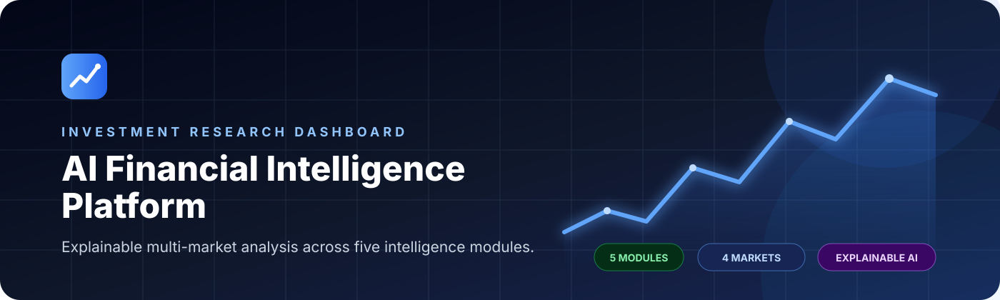
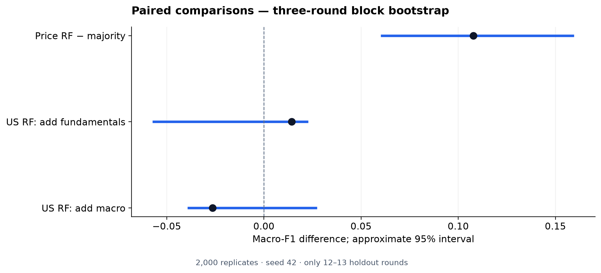
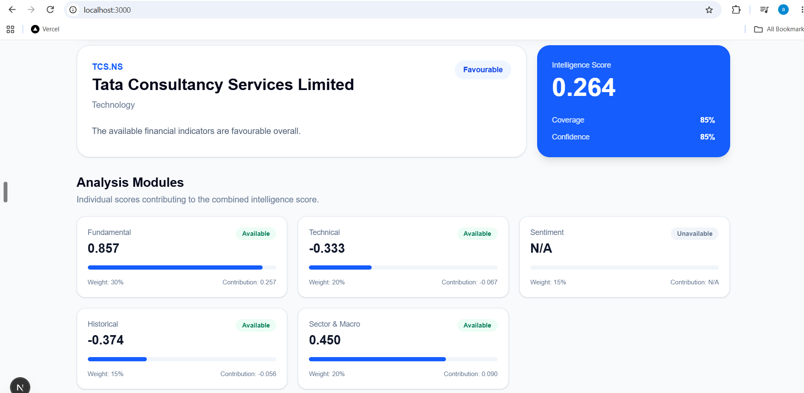
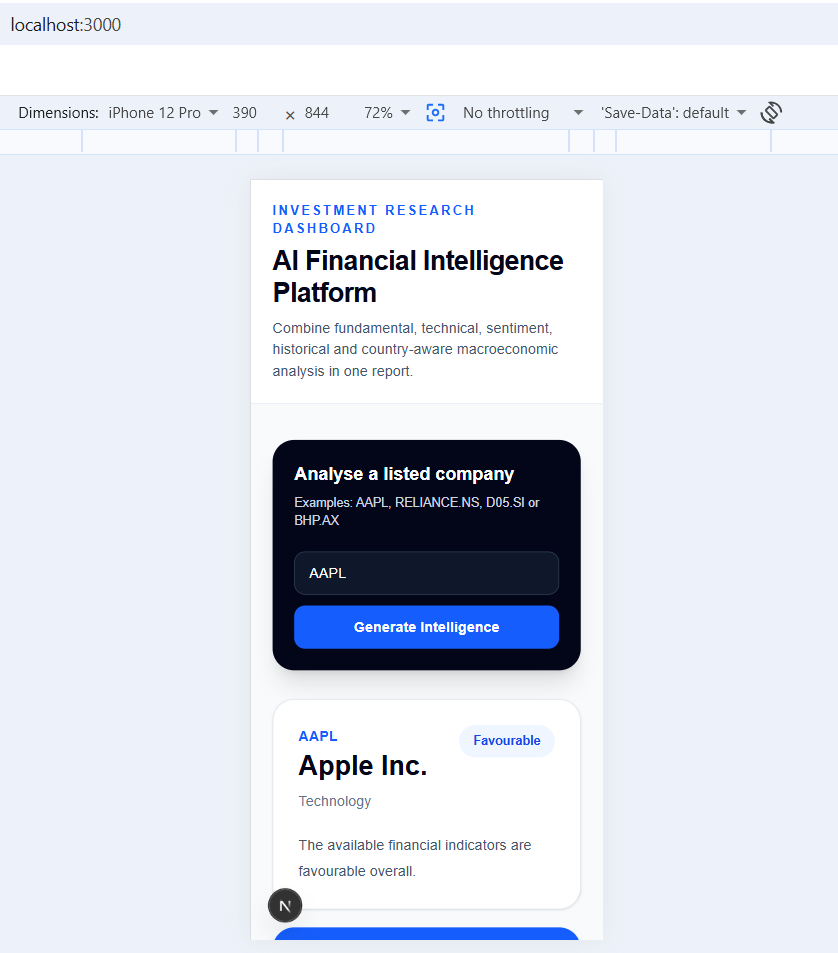
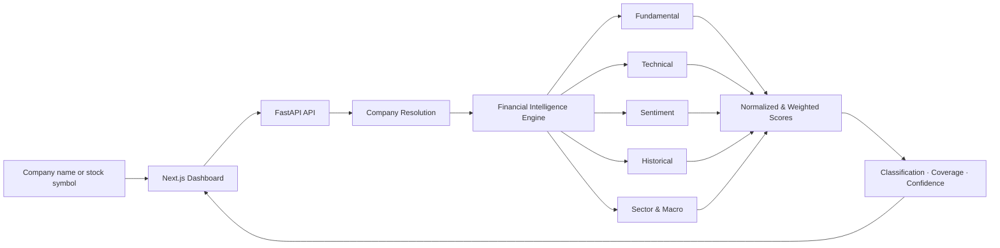
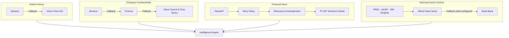

<p align="center">
  
</p>

<p align="center">
  <a href="https://ai-financial-intelligence-platform-m9jl.onrender.com">
    
  </a>
  <a href="https://ai-financial-intelligence-platform-api.onrender.com/docs">
    
  </a>
</p>

<p align="center">
  
  
  
  
  
  
  
</p>

<p align="center">
  <strong>An explainable, multi-market investment research platform that turns fragmented financial data into one transparent intelligence report.</strong>
</p>

<p align="center">
  Fundamental Analysis&nbsp;&nbsp;•&nbsp;&nbsp;Technical Indicators&nbsp;&nbsp;•&nbsp;&nbsp;News Sentiment&nbsp;&nbsp;•&nbsp;&nbsp;Historical Risk&nbsp;&nbsp;•&nbsp;&nbsp;Sector-Aware Macro
</p>

---

## Live Platform

| | Service | Link |
|:---:|---|---|
| 🚀 | **Production dashboard** | [Launch application](https://ai-financial-intelligence-platform-m9jl.onrender.com) |
| ⚙️ | **Backend API** | [Open FastAPI service](https://ai-financial-intelligence-platform-api.onrender.com) |
| 📚 | **Interactive documentation** | [Explore Swagger UI](https://ai-financial-intelligence-platform-api.onrender.com/docs) |
| ❤️ | **Service health** | [Check API health](https://ai-financial-intelligence-platform-api.onrender.com/health) |

> [!NOTE]
> The project uses Render's free hosting tier. A sleeping backend may need approximately 50 seconds to start on the first request.

---

## Historical Research Results

A completed historical study evaluates price-based equity classification
across 40 selected companies in India, the United States, Singapore, and
Australia, with separate US fundamental and macroeconomic extensions.

Models were trained on 2021-2023 data, compared on 2024 validation data,
and evaluated on a frozen 2025 holdout.

| Experiment | Holdout observations | Main finding |
|---|---:|---|
| Four-market price study | 490 | Random forest macro-F1: **0.3156**, versus **0.2079** for majority prediction; historical rules scored **0.3201** |
| US fundamentals extension | 120 | Random forest macro-F1 increased from **0.3448** to **0.3591**, but the approximate improvement interval included zero |
| US macro extension | 120 | Adding macro reduced random-forest macro-F1 to **0.3326**; no clear incremental improvement |

Performance varied by market. The pooled random forest fell below the
majority baseline on Singapore macro-F1. Classification results do not
establish trading profitability.

**Scope:** The study does not validate the complete five-module production
Intelligence Score. Historical sentiment and non-US fundamental/macro
extensions were deferred.

- [Research report](research/RESEARCH_REPORT.md)
- [Reproduction instructions](research/REPRODUCIBILITY.md)
- [Frozen evaluation protocol](research/FINAL_EVALUATION_PROTOCOL.md)
- [Scope amendment](research/SCOPE_AMENDMENT.md)
- [Saved holdout results](research/results/final_holdout/)
- [Uncertainty analysis](research/results/holdout_analysis/)



---

## Product Preview

<p align="center">
  <a href="https://ai-financial-intelligence-platform-m9jl.onrender.com">
    
  </a>
</p>

<p align="center">
  
</p>

<p align="center"><strong>Responsive from desktop research workflow to mobile review.</strong></p>

---

## Why This Platform?

Financial research is usually spread across separate price charts, company accounts, news feeds, and economic releases. This platform brings those signals together while preserving the reasoning behind the result.

| Traditional workflow | AI Financial Intelligence Platform |
|---|---|
| Multiple disconnected data sources | One consolidated research dashboard |
| Manual comparison of unrelated metrics | Five normalized analysis modules |
| Black-box scores with no explanation | Visible weights, contributions, coverage, and confidence |
| Provider outage stops the workflow | Retry, cache, and fallback data paths |
| Single-market assumptions | United States, India, Singapore, and Australia |
| Ticker-only search | Company-name and symbol resolution |

---

## Core Capabilities

| Module | Analysis | Representative outputs |
|---|---|---|
| 🏢 **Fundamental** | Valuation, profitability, growth, leverage, capital efficiency, and cash generation | P/E, P/B, margin, ROE, ROA, growth, D/E, FCF |
| 📈 **Technical** | Trend, momentum, volatility, and volume | SMA, EMA, RSI, MACD, Bollinger Bands, ATR, relative volume |
| 📰 **Sentiment** | Recent company-news sentiment using a trained ML classifier | Positive, Neutral, Negative, article ratios, overall sentiment |
| 📊 **Historical** | Return behaviour and downside risk | 1W–1Y returns, volatility, maximum drawdown, period range |
| 🌍 **Sector & Macro** | Country conditions adjusted for sector sensitivity | Inflation, GDP, unemployment, monetary environment |

Additional platform capabilities:

- Company-name and acronym resolution
- Invalid-symbol validation
- Multi-provider financial data fallback
- News relevance scoring and duplicate removal
- Official macroeconomic data caching
- Partial-data warnings instead of silent failure
- Responsive charts and metric cards
- Pydantic-validated API responses
- Automatic OpenAPI documentation

---

## How It Works



---

## Intelligence Methodology

The platform converts each module to a common `-1.0` to `+1.0` scale before combining the results.

### Module Weights

| Module | Weight | Role |
|---|---:|---|
| Fundamental | **30%** | Company financial quality and valuation |
| Technical | **20%** | Price trend and market momentum |
| Sentiment | **15%** | Recent company-news tone |
| Historical | **15%** | Return and downside-risk behaviour |
| Sector & Macro | **20%** | Economic environment and sector sensitivity |

### Score Interpretation

| Intelligence Score | Classification | Meaning |
|---:|---|---|
| `+0.50` to `+1.00` | **Strongly favourable** | Broadly supportive indicators |
| `+0.20` to `< +0.50` | **Favourable** | More supportive than adverse indicators |
| `-0.20` to `< +0.20` | **Neutral** | Mixed or broadly balanced indicators |
| `-0.50` to `-0.20` | **Cautious** | Meaningful headwinds are present |
| `-1.00` to `≤ -0.50` | **Unfavourable** | Significant adverse indicators |

### Calculation

```text
                         Sum of available weighted contributions
Intelligence Score = -------------------------------------------------
                              Sum of available module weights
```

Unavailable modules are excluded from the denominator. They reduce **coverage** instead of being incorrectly treated as negative signals.

| Output | What it tells the user |
|---|---|
| **Intelligence Score** | Direction and strength of the combined analysis |
| **Classification** | Plain-language interpretation of the score |
| **Coverage** | Percentage of configured module weight currently available |
| **Confidence** | Coverage adjusted for source and input quality |
| **Weighted contribution** | Exact effect of each module on the final score |

> [!IMPORTANT]
> The score is an explainable investment-support indicator—not a price forecast or automated recommendation to buy, hold, or sell.

---

## Resilient Data Architecture

External financial APIs can be rate-limited, temporarily unavailable, or restricted by subscription. The platform therefore uses explicit fallback chains.



### Source Strategy

| Domain | Primary sources | Resilience strategy |
|---|---|---|
| Market history | Yahoo Finance through `yfinance` | Direct Yahoo chart fallback |
| Fundamentals | Yahoo Finance | Finnhub and direct Yahoo time-series fallbacks |
| Financial news | NewsAPI | Request retries, relevance thresholds, and deduplication |
| US macro | FRED | Latest successful official snapshot cache |
| India macro | MoSPI and RBI | Official cache and World Bank fallback where appropriate |
| Singapore macro | SingStat | Configured cache and fallback path |
| Australia macro | Configured official sources | Configured cache and fallback path |

The API returns recoverable provider issues under `errors`, and the dashboard presents them as **Partial data warnings**.

---

## Supported Markets

| Market | Search examples | Resolved symbols |
|---|---|---|
| 🇺🇸 **United States** | Apple, Tesla, NVIDIA | `AAPL`, `TSLA`, `NVDA` |
| 🇮🇳 **India — NSE** | Reliance Industries, Infosys, Tata Consultancy Services | `RELIANCE.NS`, `INFY.NS`, `TCS.NS` |
| 🇸🇬 **Singapore — SGX** | DBS Group, ST Engineering | `D05.SI`, `S63.SI` |
| 🇦🇺 **Australia — ASX** | BHP, Commonwealth Bank | `BHP.AX`, `CBA.AX` |

---

## Technology Stack

<p>
  
  
  
  
</p>

<p>
  
  
  
  
</p>

| Layer | Technologies |
|---|---|
| User interface | Next.js, React, TypeScript, Tailwind CSS, Recharts |
| API | FastAPI, Uvicorn, Pydantic |
| Analytics | pandas, NumPy, yfinance |
| Machine learning | scikit-learn, TF-IDF, Joblib |
| Integration | Requests, curl-cffi, python-dotenv |
| Testing | pytest, FastAPI TestClient |
| Hosting | Render Web Service and Render Static Site |

---

## API Reference

### Generate a Financial Intelligence Report

```http
GET /api/v1/intelligence/{stock_symbol}?news_limit=5
```

```bash
curl "https://ai-financial-intelligence-platform-api.onrender.com/api/v1/intelligence/AAPL?news_limit=5"
```

<details>
<summary><strong>Response structure</strong></summary>

```json
{
  "stock_symbol": "AAPL",
  "company_name": "Apple Inc",
  "sector": "Technology",
  "intelligence_score": 0.372,
  "classification": "favourable",
  "coverage_ratio": 1.0,
  "confidence_score": 0.82,
  "module_scores": {
    "fundamental": {},
    "technical": {},
    "sentiment": {},
    "historical": {},
    "sector_macro": {}
  },
  "analysis": {},
  "errors": {},
  "generated_at_utc": "2026-08-21T05:56:46+00:00"
}
```

</details>

### Service Endpoints

| Method | Endpoint | Purpose |
|:---:|---|---|
| `GET` | `/` | API metadata and documentation path |
| `GET` | `/health` | Service health check |
| `GET` | `/api/v1/intelligence/{stock_symbol}` | Complete financial intelligence report |
| `GET` | `/docs` | Swagger UI |
| `GET` | `/openapi.json` | OpenAPI schema |

---

## Quick Start

### Prerequisites

- Python 3.12
- Node.js 18 or newer
- npm
- FRED, NewsAPI, and Finnhub API keys

### Backend

```bash
git clone https://github.com/Vinoth-Ganesamurthy/AI-Financial-Intelligence-Platform.git
cd AI-Financial-Intelligence-Platform
python -m venv .venv
```

Activate the environment:

```powershell
# Windows PowerShell
.venv\Scripts\Activate.ps1
```

```bash
# macOS/Linux
source .venv/bin/activate
```

Install dependencies:

```bash
python -m pip install --upgrade pip
pip install -r requirements.txt
```

Create `.env` in the project root:

```env
FRED_API_KEY=your_fred_api_key
NEWS_API_KEY=your_newsapi_key
FINNHUB_API_KEY=your_finnhub_api_key
FRONTEND_ORIGINS=http://localhost:3000,http://127.0.0.1:3000
```

Start the API:

```bash
python -m uvicorn src.api.main:app --reload
```

The backend will be available at `http://127.0.0.1:8000`.

### Frontend

Open another terminal:

```bash
cd frontend
npm ci
```

Create `frontend/.env.local`:

```env
NEXT_PUBLIC_API_BASE_URL=http://127.0.0.1:8000
```

Start Next.js:

```bash
npm run dev
```

Open `http://localhost:3000`.

> [!WARNING]
> Never commit `.env`, `.env.local`, or API keys to source control.

---

## Testing

### Backend Test Suite

```bash
python -m pytest -q
```

```text
26 passed
```

Coverage includes:

- Module score calculations
- Complete report aggregation
- FastAPI routes and response validation
- Company-name and acronym resolution
- Invalid-company rejection
- US macro-data resilience
- India GDP and policy-rate retrieval
- MoSPI client verification
- Provider outage and cache behaviour

### Frontend Production Build

```bash
cd frontend
npm run build
Covers:

Module score calculations

Intelligence aggregation

API routes & validation

Company resolution & rejection

Macro resilience & caching

🔮 Future Improvements
Interactive candlestick charts

Sentiment trends over time

Side-by-side company comparison

Watchlists & portfolio analysis

FinBERT sentiment model

Earnings calendar integration

Peer valuation comparisons

PDF export & saved reports

Authentication & history

Docker + CI/CD

⚖️ Disclaimer
This project is for educational and analytical purposes only.
It does not provide financial advice or guarantee future performance.
Users should conduct independent research and consult professionals before making investment decisions.

👨‍💻 Owner & Author
Vinoth Ganesamurthy

LinkedIn → https://www.linkedin.com/in/vinoth-ganesamurthy/

Developed as a full-stack financial analytics, machine-learning, and cloud-deployment portfolio project.

⭐ Support
If you find this project useful, consider giving the repository a ⭐ on GitHub.

Repository → https://github.com/Vinoth-Ganesamurthy/Real-Time-Financial-News-Sentiment-Analyzer

Live Demo → https://ai-financial-intelligence-platform-m9jl.onrender.com
