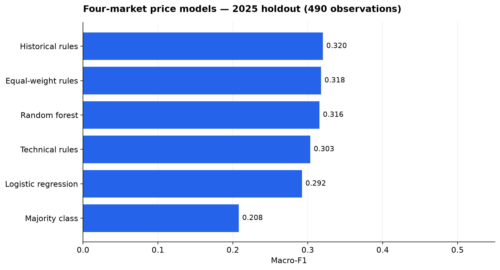
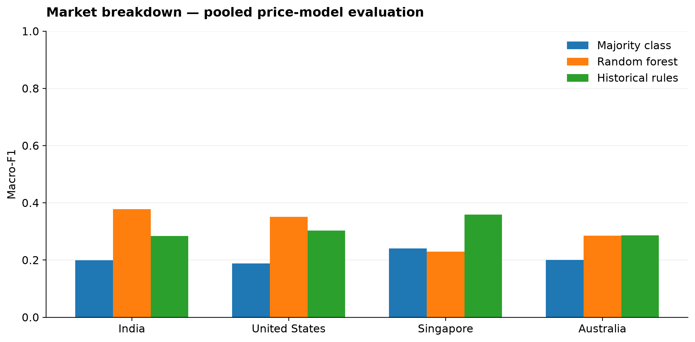
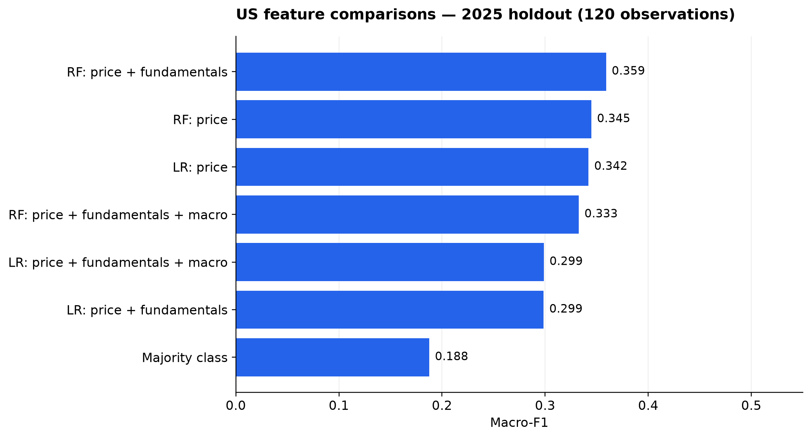
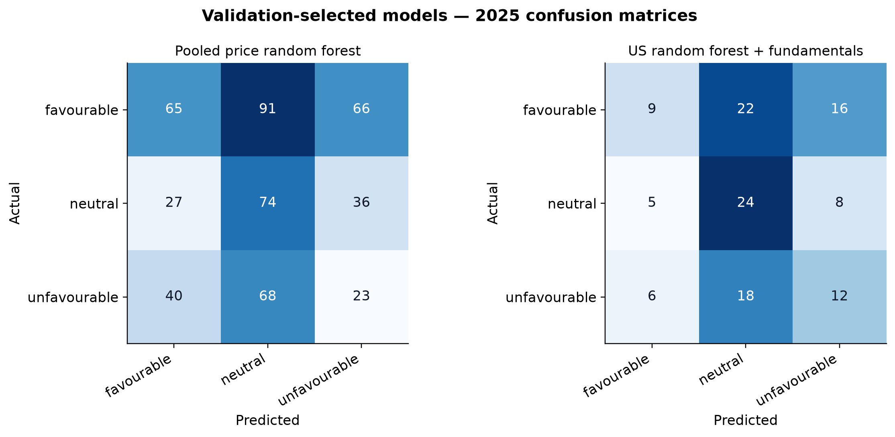

# Cross-Market Equity Classification Using Price Indicators, with US Fundamental and Macroeconomic Extensions

**Author:** Vinoth Ganesamurthy  
**Report date:** 3 October 2026  
**Status:** Completed empirical experiments; technical research report  
**Repository:** https://github.com/Vinoth-Ganesamurthy/AI-Financial-Intelligence-Platform

## Abstract

This study evaluates three-class, 20-trading-day equity classification
using historical price indicators across 40 selected companies in India,
the United States, Singapore, and Australia. A separate US experiment
examines whether annual financial-statement features and historical
macroeconomic vintages improve price-based models.

Models were trained on eligible 2021–2023 observations, compared on 2024
validation data, and evaluated on a frozen 2025 holdout. The holdout
contained 490 observations across four markets, including 120 US
observations. Preprocessing was fitted on training data only.

The pooled price random forest achieved macro-F1 of 0.3156, compared
with 0.2079 for a majority-class baseline. Historical-only rules achieved
the highest pooled holdout macro-F1, 0.3201. In the US-only experiment,
adding fundamentals increased random-forest macro-F1 from 0.3448 to
0.3591, while adding macroeconomic features reduced it to 0.3326.
Approximate paired block-bootstrap intervals included zero for both
US feature-addition comparisons.

The results show a pooled macro-F1 advantage over majority prediction,
but weak absolute performance, substantial market variation, and no clear
evidence that the US feature additions improve classification.
The complete five-module production framework was not validated.

## 1. Research Scope and Questions

The original plan proposed evaluating a combined fundamental, technical,
sentiment, historical-risk, and sector-aware macroeconomic framework.

Historical sentiment was unavailable through the current NewsAPI plan,
and point-in-time non-US fundamental and macroeconomic coverage was not
established. The scope was amended before evaluating holdout predictions.

The completed study addresses:

1. How do price-based rules and fixed machine-learning baselines compare
   across four markets?
2. Do annual SEC fundamentals improve US price-based classification?
3. Do historical US macroeconomic features provide additional improvement?

The scope amendment followed inspection of validation results.
It must not be described as an original pre-registration.

The original hypotheses concerning the full weighted Intelligence Score,
sentiment, score-return ranking, and sector-aware macroeconomic effects
were not tested by these experiments.

## 2. Dataset and Prediction Target

The company universe contains 40 selected companies: 10 per market.
It is a fixed convenience sample, not a representative sample of all
listed or historically investable equities.

Price collection covers January 2019 through February 2026. Earlier
history supports feature warm-up; post-2025 prices complete the final
forward-return targets.

Research observations span 2021–2025 and are scheduled every 20 trading
days within each company's market calendar.

The target is the adjusted-close return over the next 20 trading days:

R = 100 × (P[t+20] / P[t] − 1)

The classification specification is:

- Favourable: return greater than +2%.
- Neutral: return between −2% and +2%, inclusive.
- Unfavourable: return less than −2%.

Targets are measured in each stock's local trading currency.

### Dataset counts

| Split | Eligible observations |
|---|---:|
| Training: 2021–2023 | 1,480 |
| Validation: 2024 | 470 |
| Holdout: 2025 | 490 |
| Total | 2,440 |

There were 2,520 generated observations. Eighty were excluded under
the split-boundary eligibility rules. No forward horizons were incomplete.

The US feature comparisons used 370 training, 120 validation, and
120 holdout observations.

### Holdout class distribution

| Market | Favourable | Neutral | Unfavourable | Total |
|---|---:|---:|---:|---:|
| India | 51 | 35 | 34 | 120 |
| United States | 47 | 37 | 36 | 120 |
| Singapore | 68 | 32 | 20 | 120 |
| Australia | 56 | 33 | 41 | 130 |
| Overall | 222 | 137 | 131 | 490 |

## 3. Features and Data Availability

### Price features

The ML inputs include RSI, relative volume, normalized moving-average
distances, EMA spread, normalized MACD and histogram, Bollinger position,
ATR relative to price, price-range position, historical returns,
annualized volatility, and maximum drawdown.

Technical and historical rule scores use the production analysis
formulas on price history ending at the observation date.

Raw prices were preserved. Six isolated provider OHLC relationship
anomalies were recorded as warnings, rather than manually corrected.
Their presence limits confidence in affected high/low-based features.

### US fundamentals

Annual SEC companyfacts records were selected only when filed before
the observation date. Filing-day records were excluded conservatively.
Later filings could not enter earlier snapshots.

The ML extension uses profit margin, return on equity, return on assets,
revenue growth, earnings growth, and free cash flow divided by revenue.

Coverage is partial. Missing values remain missing before train-fitted
imputation. Forward P/E and debt-to-equity were unavailable in this
research extraction and were not ML inputs.

American Tower uses the total `Revenues` tag rather than its narrower
contract-revenue tag. `ProfitLoss` is used as an income fallback where
`NetIncomeLoss` is unavailable. This fallback does not populate ROE
without matching shareholder income.

These extraction choices preserve provenance but do not establish
perfect accounting comparability across companies.

### US macroeconomic features

Historical FRED snapshots use the calendar day before each observation
as the requested vintage.

Inputs are CPI year-over-year inflation, the monthly effective federal
funds rate, quarterly real GDP growth, and unemployment.

CPI comparisons use observations from the same requested vintage.
The requested vintage date is not presented as an original release date.

All four macro inputs were available for the 630 generated US
observations. Macro data are shared across companies at each date;
630 rows therefore do not represent 630 independent macro observations.

### Deferred components

Historical sentiment, non-US fundamental/macro extensions, and the
sector-aware macro score were not evaluated.

## 4. Models and Experimental Controls

### Four-market experiment

The six baselines are:

- Majority-class prediction learned from training labels.
- Technical rules.
- Historical rules.
- Equal-weight technical and historical rules.
- Logistic regression.
- Random forest.

Rule scores use fixed classification cutoffs of −0.2 and +0.2.
The ML models are trained on pooled four-market data.

### US experiment

Logistic regression and random forest are each evaluated with:

1. Price features.
2. Price plus fundamentals.
3. Price plus fundamentals plus macro.

A training-derived majority baseline is also included.

US models are trained only on US observations. They differ from the
pooled models whose US results appear in the market breakdown.

### Frozen settings

Logistic regression uses C=1.0, balanced class weights, and a maximum
of 3,000 iterations.

Random forest uses 300 trees, maximum depth 6, minimum leaf size 20,
balanced class weights, and random seed 42.

Median imputation with missingness indicators is fitted on training
data only. Logistic-regression scaling is also fitted on training only.

Models were not refitted on 2024 validation data for the holdout.
No model tuning followed inspection of 2025 results.

Random forest was the validation-selected pooled ML candidate.
Random forest with fundamentals was the validation-selected US candidate.
All frozen baselines are reported, including those that performed better
or worse than the selected candidates.

## 5. Evaluation and Uncertainty

Macro-F1 is the primary metric. Balanced accuracy and accuracy are
supporting metrics. Confusion matrices and class counts are retained.

The uncertainty analysis uses 2,000 paired bootstrap replicates,
seed 42, and contiguous blocks of three observation rounds.

A round is each company's chronological observation ordinal.
Company rows within sampled rounds are kept together. The same sampled
rows are used for both models in each comparison.

Percentile 95% intervals are descriptive and approximate.
Only 12–13 holdout rounds are available, and market calendars differ.
This method does not fully establish independent sampling or universal
statistical significance.

## 6. Holdout Results

### Four-market price experiment

| Model | Macro-F1 | Balanced accuracy | Accuracy |
|---|---:|---:|---:|
| Historical rules | 0.3201 | 0.3307 | 0.3531 |
| Equal-weight rules | 0.3177 | 0.3202 | 0.3429 |
| Random forest | 0.3156 | 0.3362 | 0.3306 |
| Technical rules | 0.3033 | 0.3035 | 0.3265 |
| Logistic regression | 0.2922 | 0.3481 | 0.3143 |
| Majority class | 0.2079 | 0.3333 | 0.4531 |

Historical rules achieved the highest holdout macro-F1.
The validation-selected random forest did not outperform every rule model.

The majority baseline had the highest accuracy because favourable
observations were common. Random forest's macro-F1 advantage therefore
does not imply an accuracy advantage or uniformly strong class recall.

### Market variation

| Market | Majority macro-F1 | Pooled RF macro-F1 | Historical macro-F1 |
|---|---:|---:|---:|
| India | 0.1988 | 0.3784 | 0.2839 |
| United States | 0.1876 | 0.3506 | 0.3031 |
| Singapore | 0.2411 | 0.2300 | 0.3594 |
| Australia | 0.2007 | 0.2855 | 0.2869 |

The pooled random forest performed best in India and worst in Singapore.
In Singapore it fell below the majority baseline on macro-F1.

The findings do not support a claim of consistent performance across
all four markets.

### US feature comparison

| Model and features | Macro-F1 | Balanced accuracy | Accuracy |
|---|---:|---:|---:|
| RF: price + fundamentals | 0.3591 | 0.3912 | 0.3750 |
| RF: price | 0.3448 | 0.3775 | 0.3583 |
| LR: price | 0.3421 | 0.3881 | 0.3667 |
| RF: price + fundamentals + macro | 0.3326 | 0.3856 | 0.3750 |
| LR: price + fundamentals + macro | 0.2987 | 0.3356 | 0.3250 |
| LR: price + fundamentals | 0.2985 | 0.3333 | 0.3167 |
| Majority class | 0.1876 | 0.3333 | 0.3917 |

Fundamentals slightly improved random-forest macro-F1 but reduced
logistic-regression macro-F1. Adding macro did not improve the
random-forest result. Feature additions did not help consistently.

### Paired uncertainty comparisons

| Comparison | Macro-F1 difference | Approximate 95% interval |
|---|---:|---:|
| Pooled price RF minus majority | +0.1078 | +0.0601 to +0.1596 |
| US RF: add fundamentals | +0.0143 | −0.0573 to +0.0228 |
| US RF: add macro after fundamentals | −0.0265 | −0.0392 to +0.0273 |

The pooled random-forest advantage over majority prediction remained
positive under this bootstrap procedure.

Both US feature-addition intervals include zero. The study therefore
does not establish a clear improvement from either addition.
An interval containing zero is not proof that the features have no effect.

## 7. Interpretation

The main finding is limited rather than conclusive: price-based models
can improve macro-F1 over majority prediction in this selected sample,
but absolute classification performance remains modest.

Simple historical rules matched or exceeded the pooled ML candidates.
Results varied substantially by market.

US fundamentals produced a small random-forest improvement whose
uncertainty interval crossed zero. Raw macroeconomic inputs did not
provide a consistent incremental benefit.

These results do not validate the production Intelligence Score,
establish causality, or demonstrate a profitable trading strategy.

## 8. Limitations

- The fixed company universe may introduce selection and survivorship bias.
- Only one holdout year and a small number of observation rounds were used.
- The US experiment contains only 10 companies and 120 holdout rows.
- SEC tag definitions and financial-sector accounting can differ.
- Annual financial statements can be stale at observation dates.
- Missingness and imputation can affect model comparisons.
- Six provider OHLC anomalies were retained and documented.
- Historical adjusted prices were retrieved later; price adjustment
  vintages were not reconstructed as originally available at each date.
- Market calendars differ, limiting bootstrap round alignment.
- Macro features have fewer independent time observations than row counts.
- Fixed ±2% labels do not account for market-specific volatility.
- No transaction-cost, execution, portfolio, or profitability evaluation
  was performed.
- Historical sentiment and non-US enrichment were deferred.
- Sector-specific effects, calibration, ranking, and alternative-threshold
  robustness analyses from the original plan were not completed.
- This report is not a peer-reviewed publication or a novelty assessment.

## 9. Reproducibility

The repository preserves configuration, experiment scripts, input hashes,
source provenance, model settings, predictions, metrics, bootstrap
intervals, and figure-generation code.

Relevant documents:

- [Original research plan](RESEARCH_PLAN.md)
- [Scope amendment](SCOPE_AMENDMENT.md)
- [Data availability](DATA_AVAILABILITY.md)
- [Frozen evaluation protocol](FINAL_EVALUATION_PROTOCOL.md)
- [Data dictionary](DATA_DICTIONARY.md)

Key outputs:

- `results/final_holdout/`
- `results/holdout_analysis/`
- `figures/`

Raw datasets and credentials are excluded from Git. Exact reproduction
requires the original local data snapshots; newly downloaded provider
data may differ.

The latest full test run before figure generation reported
121 passed tests and five dependency warnings.

## 10. Conclusion

This scoped study provides reproducible evidence of modest and uneven
20-trading-day equity classification performance.

The pooled random forest exceeded majority prediction on macro-F1,
but did not exceed the strongest historical rule baseline and did not
perform consistently across markets.

The US experiments did not establish a clear incremental benefit
from fundamentals or macroeconomic features under the specified
uncertainty analysis.

The contribution is an auditable experimental pipeline and an honest
assessment of its predictive limits, rather than a validated investment
recommendation system.

## Data and Software References

- SEC companyfacts API:
  https://www.sec.gov/search-filings/edgar-application-programming-interfaces
- FRED observations API:
  https://fred.stlouisfed.org/docs/api/fred/series_observations.html
- scikit-learn:
  https://scikit-learn.org/
- pandas:
  https://pandas.pydata.org/
- NumPy:
  https://numpy.org/
- Matplotlib:
  https://matplotlib.org/
- Yahoo-derived price collection uses the source routing recorded
  in the repository's price manifests and collector code.

## Disclaimer

This study is educational research. It does not provide investment
advice or guarantee future performance.